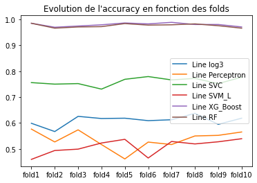
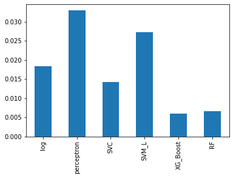
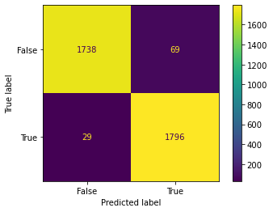



**Sommaire**

[I. Introduction](#_rk1qoh74neqr)

[II. Jeu de données et traitement](#_2pt8bj6o8c95)

[A. Étude univariée](#_ohveqpg5s30f)

[B. Étude bivariée](#_nuekrvov5k7n)

[III. Modélisation et analyse du phénomène](#_9qavb0rpo64h)

[A. 1ère phase de modélisation (avant features selection)](#_bojhyjfwed5g)

[B. 2ème phase de modélisation (après feature selection)](#_x2nq165m4b1f)

[IV. Conclusion et limite de l’approche](#_ozr8zn9dfkyr)

[V. Annexes](#_y8ukq4nviegd)

# **
1. # **Introduction**
Notre projet s’articule dans le cadre du cours Machine learning : SVM et Réseaux de neurones sous python. Afin d’évaluer notre degré de maîtrise de la démarche économétrique en matière de méthodes de *machine learning*, nous nous sommes lancés dans un projet *Kaggle* portant sur la détermination des critères financiers pouvant expliquer la faillite, ou non, des entreprises.

La base est initialement composée de 95 variables décrivant le profil financier d’une entreprise. L’objectif va être de déterminer le meilleur modèle pouvant prédire la faillite. 

L’intérêt de notre démarche est de prouver l’efficacité, ou non, des modèles de machine learning dans la captation du séisme économique que peut représenter la faillite.

Si nous prenons le temps de nous poser la question : **Qu’est-ce qui fait qu’une entreprise dépose le bilan ou non ?** L’on pourrait évoquer des défaillances de gestion, des décisions d’investissements mal menées ou encore une mauvaise anticipation des changements du secteur d’activité (Alcatel, Nokia, Kodak, …). 

Nous espérons pouvoir creuser plus en profondeur l’utilité de certains ratios financiers d’une entreprise, est le levier, ou la massue, que cela peut constituer pour elle. 
1. # **Jeu de données et traitement**

Dans le cadre de notre projet, nous avons opté pour une base comportant 96 variables pour un total de 6 819 observations. Nous sommes donc face à une base que l’on peut qualifier de  “*Huge*” (un nombre important de variables et d’observations).

Notre variable à expliquer, ou *target*, est “*Bankrupt?*”, que l’on renommera *“Bankruptcy*”. Il s’agit d’une variable binaire qui prend les modalités suivantes :  0 pour une entreprise en non-faillite ; 1 pour une entreprise en faillite. 

À l’image des fraudes, la faillite d’une entreprise est un événement relativement rare, un fait illustré par le déséquilibre au niveau de la répartition de notre *target* puisque l’on remarque que : 

- La non-faillite, *False*, représente 96.77 % de nos entreprises.
- La faillite, *True*,  représente 3.23 % de nos entreprises.

On anticipe alors un besoin de procéder à un rééquilibrage de notre jeu de données via une méthode de rééchantillonnage. Nous partirons sur de “*L’OverSampling*” via l’algorithme SMOTE (Synthetic Minority Over-sampling Technique).

Les 95 variables explicatives, ou *features*, sont composées de 2 variables qualitatives et 93 variables quantitatives. La majorité de ces variables représente des indicateurs financiers servant à mesurer la performance financière de l’entreprise, des informations utiles quand il s’agit de déterminer la probabilité de “*déposer le bilan*”* pour une tierce entreprise.

**Première étape** de notre travail d’étude : se pencher sur les données et essayer d’en corriger les éventuels défauts pour assurer la fiabilité des résultats de notre partie “Modélisation et analyse du phénomène”.  

Par “défauts” l’on entend la présence de : “*Outliers*”, valeurs extrêmes, valeurs manquantes ou encore des problèmes d’échelle.

Notre base comporte bien deux des défauts susmentionnés (“*Outliers*” et écart d’échelle). Des défauts que nous nous sommes empressés de corriger via l’écart interquartile pour les “*Outliers*” (on perd alors 549 observations au total) et la standardisation (centrage, soustraction de l’espérance, réduction, division par l’écart type) pour l’homogénéité de nos échelles.

**Seconde étape**, nous nous devons d’extraire un maximum d’informations de ces données. Or, l’on remarque que le nombre de variables n’aide pas pour la partie **statistiques descriptives**.  Nous pensons alors judicieux d’entamer une pré-étape de “*Features selection*”, afin de réduire le nombre de dimensions et faciliter l’analyse statistique (uni, bi et multivariée).

Les techniques de réduction utilisées sont au nombre de trois : une régression pénalisée de type *LASSO* (extrêmement contraignante), un *SGDClassifier* avec comme penalité une régression pénalisée type *Elastic-Net* (compromis entre *RIDGE* et *LASSO*), une sélection *RFECV* (Recursive Feature Elimination, Cross-Validated). Nous avions également tenté une sélection via *Random Forest*, mais les contraintes de calcul ont fait que nous avons abandonné la méthode.

À la suite, nous obtenons trois bases : base\_lasso, base\_elasticnet et base\_RFECV avec respectivement 22, 10 et 14 variables (en plus de notre *target*). 

Des résultats qui viennent en contre-sens de la gradation qui a motivé notre choix. Les degrés de flexibilité des méthodes ne sont pas illustrés par le nombre de variables retenues.

**Troisième étape**,  nous analysons statistiquement nos bases et leurs variables respectives pour déterminer la viabilité statistiques de nos couples “*target*/*feature*”. C’est ce que nous allons explorer dans la partie “Étude bivariée”. 

Pour la suite de notre étude, nous avons fait le choix de modéliser avec la **base LASSO**. C’est la base qui comporte le plus de variables, 22, exempts de multicolinéarité puisque *LASSO*** tranche quand deux variables sont fortement corrélées entre elles.  
1. ## **Étude univariée**
Nous nous sommes intéressés à notre *target* “*Bankruptcy*”. Comme mentionné précédemment, à l’origine, notre base était extrêmement déséquilibrée, via de “*l’OverSampling*” nous avons réussi a artificiellement monté le nombre d’entreprises en faillite pour atteindre une égalité en termes de représentativité (50 % d’observations pour chacune de nos modalités).
1. ## **Étude bivariée**
Après nettoyage de notre base, nous avons effectué une série de tests :

- ⍴, correlation, pour nos variables quantitatives.* 
- Khi², pour nos variables qualitatives.
- T-test, ou test de *Student*, pour nos couples hybrides.

Ici l’objectif est de procéder à une vérification statistique de la véracité de la présence de certaines variables dans notre jeu de données. Pour notre base *LASSO*, deux variables n’ont pas passé le T-test et ont donc été écartées de la base. Nous passons d’une base de 22 variables à une base de 20 variables.

Plus bas, nous avons la matrice des corrélations pour nos variables quantitatives. Cette sélection étant issue d’une régression pénalisée type *LASSO*, nous remarquons l’absence de corrélations extrêmes et en conséquence l’absence de multicolinéarité.

1. # **Modélisation et analyse du phénomène**
1. ## **1ère phase de modélisation (avant *features selection*)**
Après la *“feature selection*”, nous avons lancé nos algorithmes sur la base de données finale. Nous utilisons trois modèles de machine learning (*Random Forest*, *XGBoost* et *SVM*) et deux modèles de réseaux de neurones (*Perceptron* et *ANN*). Nous ajoutons à cela un modèle de régression logistique. 

L'objectif est de déterminer le modèle le plus performant. Notre variable dépendante étant une variable binaire, nous avons utilisé des modèles de classification. Cette première phase de modélisation concerne 20 variables.

Afin de comparer nos modèles, nous avons effectué une cross-validation avec 10 classes, nous pouvons observer l’évolution des *accuracy* sur le graphique ci-dessus. 

L’algorithme *XGBoost* et le *Random Forest* offrent les meilleurs résultats. 

Le *SVM linéaire* et le *perceptron* présentent les plus faibles capacités prédictives avec des *accuracy* inférieures à celles du modèle de régression logistique.  Toujours sur les SVM, le modèle non linéaire semble être le plus adapté à notre jeu de données. Ce dernier donne de meilleures prédictions que la régression logistique, mais reste assez loin derrière nos deux meilleurs algorithmes que sont *XGBoost* et *Random Forest*. 

Graphique: écart type

Étant donné l’inconstance de certaines courbes, nous nous intéressons aux variations de *l’accuracy* entre les différentes classes pour chacun de nos modèles. Pour ce faire, nous nous intéressons à l’écart type entre les classes avec le graphique ci-dessus. En effet, un écart type élevé indique un risque de **sur-apprentissage** sur l’échantillon d’apprentissage. 

Le *Random Forest* et *XGBoost* ont le plus faible risque de sur-apprentissage, a contrario, le *Perceptron* et le *SVM* linéaire affichent les écarts types les plus élevés et donc la probabilité de sur-apprentissage est plus élevée pour ces deux algorithmes. 

Graphique: Évolution de l’*accuracy* avec l’*ANN*

Pour le modèle *ANN* l’*accuracy* est quasiment constante, mais elle est relativement faible. Il affiche l’*accuracy* le plus faible avec une valeur de 0.51.

1. ## ` `**2ème phase de modélisation (après *feature selection*)**
*XGBoost* et *Random Forest*  se présentent comme étant nos meilleurs modèles avec des *accuracy* très élevées et un risque de sur-apprentissage faible par rapport à la majorité des modèles.  Nous tentons néanmoins de tuner notre SVM non linéaire afin de voir s’il peut afficher de meilleurs résultats. Pour cela, nous nous servons du *GridSearch.* Malgré cela, la qualité de notre modèle ne s'est pas améliorée, elle s'est même dégradée, passant d’une *accuracy* avoisinant les 0,75 à une *accuracy* de 0,51.

Finalement, nos meilleurs modèles restent *Random Forest* et *XGBoos*t. Ces derniers présentent des résultats similaires, comme peuvent en témoigner le graphique d’évolution des *accuracy* et les matrices de confusion disponibles en annexe.

1. # **Conclusion et limite de l’approche**
Au terme de notre étude, nous sommes arrivés aux conclusions suivantes : 

- Les modèles ensemblistes sont les plus adaptés pour prédire la faillite des entreprises. 
- Nos deux modèles *Random Forest* et *XGBoost* offrent les meilleures capacités prédictives avec un risque de sur-apprentissage relativement faible.
- Les réseaux de neurones ainsi que le modèle *SVM* linéaire sont les moins adaptés à notre jeu de données. 

Concernant le travail en lui-même, il est important de noter que l’apprentissage des réseaux de neurones n’a pas été développé tant que ça. Il aurait été plus judicieux d’optimiser le paramétrage de ces derniers afin d’espérer avoir de meilleurs résultats. Il convient néanmoins de préciser malgré tout que l’ensemble de nos résultats est valable dans les limites de notre échantillon ainsi que de celles des variables à notre disposition. La partie *Feature selection* aurait pu être faite autrement. Nous avons pris un parti pris en optant pour les régressions pénalisées, mais une sélection en étudiant les corrélations était également envisageable. L’exploration des données nous semble améliorable d’un point de vue économétrique, mais aussi graphique (possibilité de retranscrire le lien entre nos variables).
1. # **Annexes**

Annexe 1: matrice de confusion Random Forest

Annexe 2: matrice de confusion XG boost

